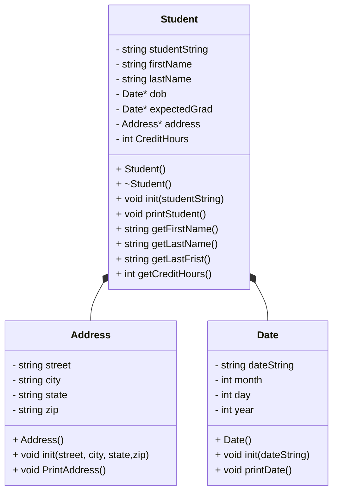

# CS121-Heap-of-Students-Part-1-Project
## UML Class Diagram 

##Address Class
```
Address()
    - init(string, street, string city, string, state, string zip) 
        -  street = s
        - city = c 
        - state = state
        - zip = zip 
    - printAddress() 
        - print street 
        - print city, state and zip 
```

##Date Class
``` 
date() 
    - month = 0 
    - day = 0 
    - year = 0 
    
    - init(d) 
        - dateString = d
        - stringstream (d)
        - read month 
        - read / 
        - read day 
        - read / 
        - read year 
    
    - printDate() 
        - if ( month == 1) 
            - print month name 
        - print day and year (srd::cout << day << year) 
```

##Student Class
``` 

Student() 
    - create date object for birth date
        - dob = new Date()
    - create data object for graduation date 
        - expectedGrad = new address() 
    - create address object 
        - address = new address() 
    - credit hour = 0 

    ~Student()
        - delete birth date  
             - delete dob
        - delete graduation date
            - delete expectedGrad
        - delete the address
            - delete address
    - init(s) 
        - student string = s
        - create stringstream 
            - std::string street
            - std:: string city
            - std::string state
            - std::string zip 
            - std:: dobString
            - std::string gradString

        - get first name 
            - getline(ss, firstname) 
            - getline(ss, lastname)
            - getline(ss, street) 
            - getline(ss, city) 
            - getline(ss,state)
            - getline(ss,  zip) 
            - getline(ss dob) 
            - getline(ss, grad) 
            - getline(credit hour) 

        - adress information to addrress
            - address-> init( street, city, state and zip ) 
        - birth date to date 
            - dob-> init (dobstring) 
        - graduation date to date 
            - expectedGrad-> init(grad) 

        - printStudent()
            - print student name
            - print address 
            - print birth date 
            - print graduation date 
            - print credit hours 
        
        - getFirstname() 
            - return firstname 
        - getLastname() 
            - return lastname
        - getlastfirst() 
            - return last name and then first name 
        - getcredithours() 
            - return credit hours 
```

##Main 
```
Main() 
    int main 
        - print hello 
        - test date 
        - test address 
        - test student 
        - return 0 
} 

testdate() 
        - date d 
        - add date (01/27/1997) 
        - print date
testAddress() 
        - address a; 
        - add address (123 W main street, muncie, IN and 47303) 
        - print address
testStudent() 
        - create student information ( "Danielle,Johnson,32181 Johnson Course Apt. 389,New Jamesside,IN,59379,02/17/2004,05/15/2027,65") 
        - loop student 
        - add student information 
        - print student information 
        - print student last name and first name 
        - delete student
```
   
